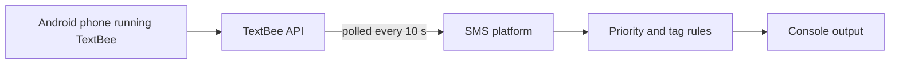

# GhostWriter

[](https://github.com/bromigos-org/GhostWriter/actions/workflows/ci.yml)
[](pyproject.toml)
[](LICENSE)


GhostWriter is a prototype of a unified inbox. It pulls in messages from your
messaging apps, scores how urgent each one is, and tags what it is about. The
goal was one place to triage Slack, email, Discord, Telegram and SMS.

> **Status: inactive since August 2025.** Only SMS intake and priority scoring
> were built. Discord intake is experimental. Slack, Gmail, Outlook and
> Telegram were never started. Nothing deploys or depends on this code. The
> repo is a candidate for archiving.

## What works today

| Feature | State |
|---|---|
| SMS intake through [TextBee](https://textbee.dev) | Works |
| Priority scoring and context tags | Works |
| SMS sending through TextBee | Built into the SMS client, but nothing calls it |
| Discord intake through OAuth | Experimental. See [Discord](#discord-experimental). |
| Slack, Gmail, Outlook and Telegram | Not started |
| Summaries, AI replies and auto-replies | Not started |

## How it works



GhostWriter runs as a console app.

1. It polls each enabled platform for new messages.
2. It converts every message to one shared `UnifiedMessage` model.
3. It scores the message's priority and tags its content.
4. It prints the result. High and urgent messages get a highlighted summary.

It skips messages it has already seen during the current run. It stores
nothing about SMS messages, so a restart sees old messages again.

### Priority rules

Scoring uses keyword rules, not a language model. The rules live in
`src/ghostwriter/processor.py`. The first rule that matches wins.

1. **Urgent.** The message contains a word like "urgent", "asap", "emergency",
   "help", "problem", "error" or "down".
2. **High.** The message contains a word like "important", "deadline",
   "meeting", "call", "review", "payment" or "invoice".
3. **Low.** The message contains a word like "fyi", "update", "newsletter",
   "reminder" or "digest".
4. **Everything else** starts at a score of 0.5, which is medium. Then:
   - An SMS shorter than 50 characters gains 0.1.
   - An SMS from a number not in your contacts loses 0.1. There is no contact
     list yet, so every number counts as unknown.
   - A message sent before 8 AM or after 6 PM gains 0.1.

   A score of 0.8 or more is urgent. A score of 0.6 or more is high. A score
   of 0.3 or less is low.

### Context tags

Every message gets a `platform:<name>` tag. It can also get these tags.

| Tag | Added when the message mentions |
|---|---|
| `meeting` | meeting, call, zoom, teams |
| `financial` | payment, invoice, bill, charge |
| `security` | password, login, security, account |
| `delivery` | delivery, package, shipped, tracking |
| `time-sensitive` | today, tomorrow, asap, urgent |
| `contains-link` | a URL |
| `contains-phone` | a phone number |

## Run it

You need:

- Python 3.12 or later.
- [Poetry](https://python-poetry.org) 2.
- A [TextBee](https://textbee.dev) account and an Android phone with the
  TextBee app.

Clone the repo and install it.

```bash
git clone https://github.com/bromigos-org/GhostWriter.git
cd GhostWriter
poetry install
```

Connect your phone to TextBee.

1. Sign up at [textbee.dev](https://textbee.dev).
2. Install the TextBee app from [dl.textbee.dev](https://dl.textbee.dev) and
   grant it SMS permissions.
3. In the TextBee dashboard, click **Register Device** and scan the QR code
   with the app.
4. Copy your API key and device ID from the dashboard.

Create your settings file and add the key and device ID.

```bash
cp .env.example .env
```

Start GhostWriter.

```bash
poetry run ghostwriter
```

It prints `GhostRider is running. Press Ctrl+C to stop.` and then logs each new
SMS as it arrives. The console says "GhostRider", the project's earlier name.
Press Ctrl+C to stop it.

## Configure it

GhostWriter reads settings from the environment and from `.env`. See
`.env.example` for every setting. Nested settings use a double underscore, such
as `SMS__POLLING_INTERVAL`.

| Variable | Default | Purpose |
|---|---|---|
| `TEXTBEE_API_KEY` | none | TextBee API key. SMS is turned off without it. |
| `TEXTBEE_DEVICE_ID` | none | TextBee device ID. SMS is turned off without it. |
| `SMS__ENABLED` | `true` | Turns SMS intake on or off. |
| `SMS__POLLING_INTERVAL` | `10` | Seconds between TextBee polls. |
| `DISCORD__ENABLED` | `false` | Turns on the experimental Discord platform. |
| `DISCORD__CLIENT_ID` | none | Discord OAuth app client ID. |
| `DISCORD__CLIENT_SECRET` | none | Discord OAuth app client secret. |
| `DISCORD__REDIRECT_URI` | `http://localhost:8080/callback` | OAuth redirect URI. |
| `DISCORD__ENCRYPTION_KEY` | generated per run | Fernet key that encrypts stored Discord tokens. |
| `DISCORD__DB_PATH` | `ghostwriter.db` | SQLite file for Discord tokens and messages. |
| `PROCESSING__PROCESSING_INTERVAL` | `5` | Seconds between polls for platforms without their own interval. |

`.env.example` also lists Slack, Gmail and other processing settings. The code
reads them, but no feature uses them yet.

### Discord (experimental)

The Discord platform signs in as a Discord user through OAuth. It then reads
the latest messages from that user's channels. It stores tokens, encrypted,
in a local SQLite file.

The main app never runs the sign-in step, so it reads nothing from Discord on
its own. The scripts `test_discord.py` and `test_discord_with_callback.py` at
the repo root walk through the OAuth flow by hand. The second one opens your
browser and listens on port 8080 for the callback.

Set `DISCORD__ENCRYPTION_KEY` if you want stored tokens to survive a restart.
Without it, each run makes a new key and cannot read old tokens.

## Test and lint

```bash
poetry install --with dev
poetry run pytest tests/test_main.py tests/test_simple.py
poetry run ruff check src tests
poetry run ruff format --check src tests
poetry run mypy src
```

CI runs exactly these checks on Python 3.12 and 3.13. See
`.github/workflows/ci.yml`. CI is currently red because
`src/ghostwriter/database/manager.py` needs `ruff format`.

The other test files are out of date. `tests/test_message_processor.py` and
`tests/test_sms_integration.py` have failing tests. `tests/test_integration.py`
fails to import.

To run the same checks before each commit, install the pre-commit hooks.

```bash
poetry run pre-commit install
```

## Project layout

| Path | Contents |
|---|---|
| `src/ghostwriter/main.py` | Entry point for the `ghostwriter` command. |
| `src/ghostwriter/core.py` | Starts platforms, polls them and hands messages to the processor. |
| `src/ghostwriter/processor.py` | Priority rules and context tags. |
| `src/ghostwriter/models.py` | The shared message models. |
| `src/ghostwriter/config.py` | Loads settings from the environment. |
| `src/ghostwriter/platforms/` | The SMS and Discord platform clients. |
| `src/ghostwriter/database/` | SQLite storage for the Discord platform. |

## Contributing

The project is inactive, so pull requests may not get a review. If you want to
pick it up, open an issue first.

## License

MIT. See [LICENSE](LICENSE).
